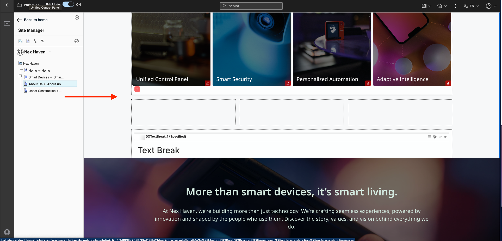
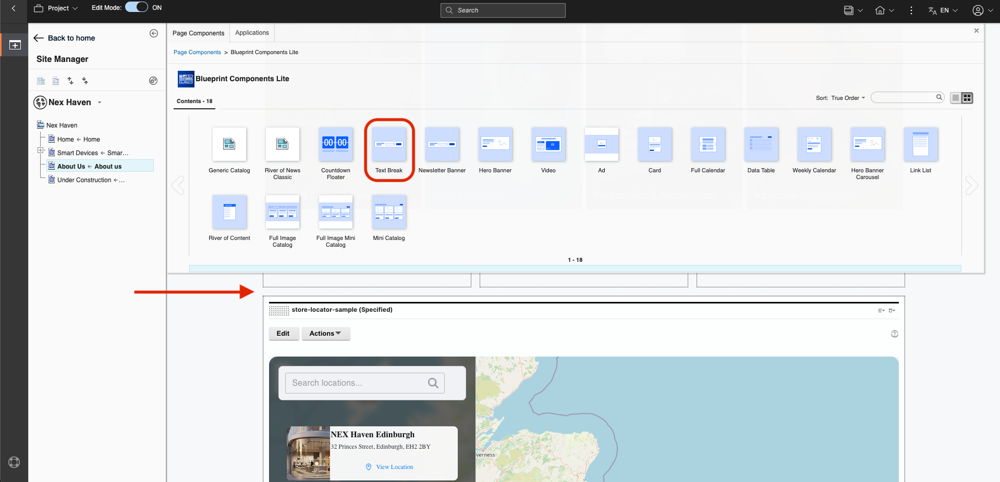
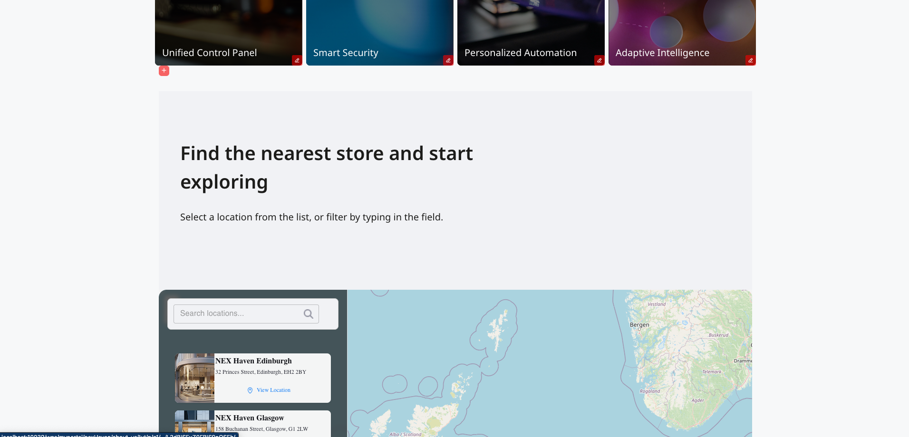

# Nex Haven Store Locator Sample

This sample script application demonstrates how to build a modern, script application for DX environments. It is designed for integration with the [Nex Haven Site](https://help.hcl-software.com/digital-experience/9.5/latest/build_sites/nex_haven/) and showcases best practices for DX script applications.

## Features & Technologies

- **Material UI**: Used for a polished, responsive component library
- **OpenStreetMap API**: Interactive map with store markers
- **DXClient**: [Automated deployment](../../README.md) to DX Server
- **create-dx-script-app**: [Rapid project scaffolding](../../README.md) and build tools
- **TypeScript + Vite**: Fast development, HMR, and type safety
- **Custom Store Cards**: Realistic data, images, and clickable selection
- **Search Bar**: With custom icon and styled input
- **Responsive Layout**: Two-column design, 75% viewport width
- **Clean, Maintainable CSS**: Refactored and optimized for scalability

## Running and Deploying the Sample

```sh
cd <dir/to/samples/nex-haven-store-locator-sample>
npm install
npm run dev      # (optional) Serve the app locally for development
npm run build    # Build the production bundle
npm run dx-deploy # Deploy the app to your DX Server
```

## How This Was Built

- Started from the `react-ts` Vite template of create-dx-script-app
- Added store locator UI, map integration, and search functionality
- Enhanced with Material UI and OpenStreetMap
- Automated deployment and DX integration
- Refactored for maintainability and scalability

## Steps to Integrate in the Nex Haven Site

Upon deployment, the script application will be placed in the Script Application Library by default. This location is defined by the `DX_SITE_AREA` parameter in your env file or the `wcmSiteArea` parameter for dxclient.

**Prerequisite:** The Nex Haven Site must already be available in your DX Server. If not, follow this [guide to create the sample site](https://opensource.hcltechsw.com/dx-blueprint-storybook/latest/?path=/docs/how-to-create-the-sample-site--documentation).

**Integration Steps:**

1. Add the Store Locator sample to the `About Us` site area of Nex Haven. It is recommended to insert it in the area shown below:

   

2. To make the Store Locator feel more integrated, insert a [`Text Break with No Button` Component](https://opensource.hcltechsw.com/dx-blueprint-storybook/230.0.0/?path=/story/components-general-text-break--text-break-no-button) from Blueprint Components above the Store Locator.

   

   Use the following attributes for the newly added text break:
   - **Title:** Find the nearest store and start exploring
   - **Subtitle:** Select a location from the list, or filter by typing in the field.
   - **Background color:** 241 242 245
   - **Text color:** 28 28 26
   - **Align:** left

3. After editing, your site should look like this (outside edit mode):

   

## HCL DX Script Applications and DXClient

This project was created as a Script Application for HCL Digital Experience. For comprehensive information about Script Applications in HCL DX, refer to the official documentation:

- [DXClient Script Applications Documentation](https://help.hcl-software.com/digital-experience/9.5/CF230/extend_dx/development_tools/dxclient/dxclient_artifact_types/scriptapplications/)

The documentation covers:
- Script Application artifact types
- How to create, update, and deploy Script Applications using DXClient
- Working with Script Application properties and configurations
- Integration with the HCL DX platform
